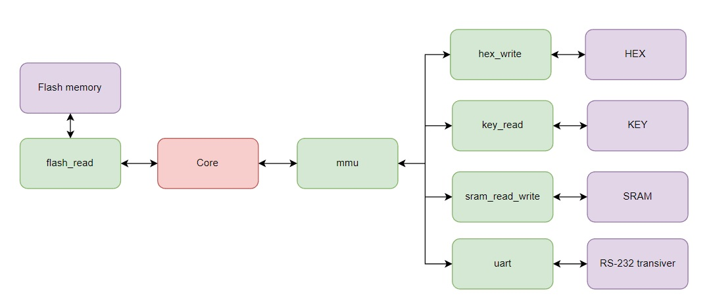

image::../img/dev_board.jpg[]
Отладочная плата с переферией

image::../img/programmer.jpg[]
Программатор для записи исполняемого кода

RTL схема верхнего уровня

== Ограничения, налагаемые на выполняемый код
Поскольку для данной реализации нет загрузчика и память программ и данных разделена физически, то код начинает выполняться с начала выполнения функции *main*. Это означает что нет доступа к сегменту данных. Стек и куча располагаются в SRAM. 

Имеется возможность вывести 32 разрядное число на группу семисегментных индикаторов(HEX).

Имеется возможность получить нажатие на кнопку от пользователя(KEY).

А также отправить/принять 1 байт по UART.

Для обращения к периферийным устройствам требуется обращение по указателям.

_Пример кода с расчетом чисел фибоначи, выводом на индикатор, отправкой их по UART и ожиданием нажатия на кнопку для продолжения_
[source,C]
----
#include <stdlib.h>
#include <stdio.h>
#include <stdint.h>

// Адреса указателей периферии
#define HEX_ADDR 0x80000004
#define KEY_ADDR 0x80000008
#define UART_ADDR 0x8000000C

int main()
{
    uint32_t *hex_ptr = (uint32_t *)HEX_ADDR;
    uint32_t *key_ptr = (uint32_t *)KEY_ADDR;
    uint32_t *uart_ptr = (uint32_t *)UART_ADDR;
    
    uint32_t num_1 = 1;
    uint32_t num_2 = 1;
    uint32_t num = 0;

    // 1 1 2 3 5 8 13
    while(1)
    {
        num = num_1 + num_2;
        num_2 = num_1;
        num_1 = num;

        // отображение данных на индикаторе
        *hex_ptr = num;

        // отправка данных на uart
        uint32_t tmp = num;
        uint32_t show[10];
        for (int k = 0; k < 10; k++)
        {
            show[9 - k] = tmp % 10 + '0';
            tmp /= 10;
        }
        for (int k = 0; k < 10; k++)
           *uart_ptr = show[k];

        *uart_ptr = 13;
        *uart_ptr = 10;
        
        // ожидание нажатия на кнопку
        while (*key_ptr != 1);

    }
    return 0;
}
----

После этого получаем *mem.v* файл. Как это сделать описано выше.

Далее с помощью скрипта */STM32_WRITE_FIRMWARE/stm_write_firmw.py* прошиваем память. Для этого подключаем ее к STM32(*Соответствующая прошивка еще не добавлена в репозиторий*). Сначала выполняем полную очистку памяти, а потом прошивку. После этого подключаем память к FPGA и выполнение можно начинать.